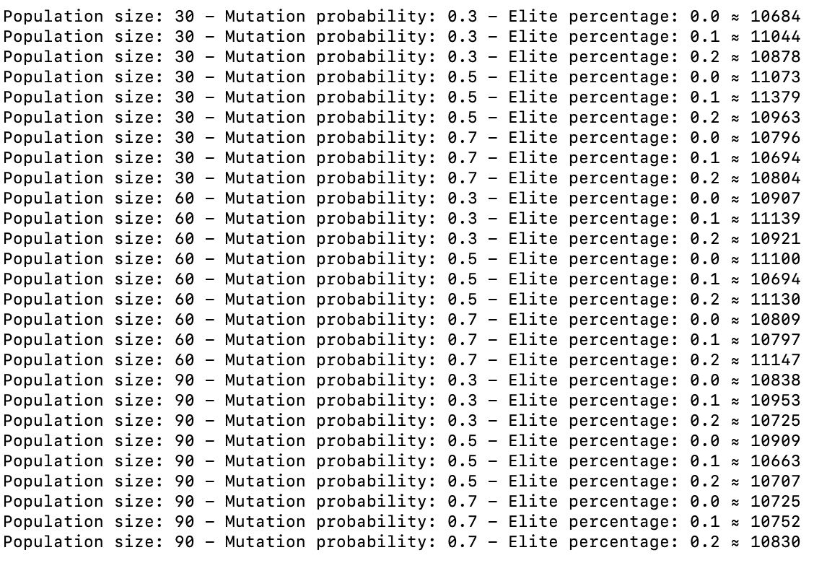
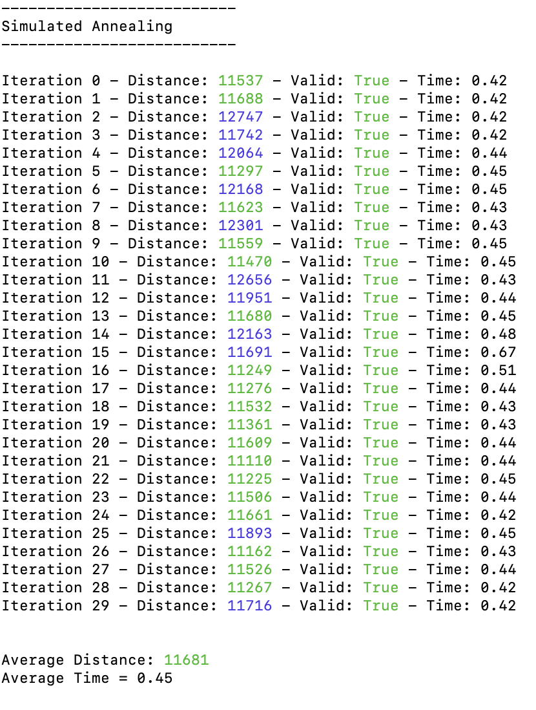
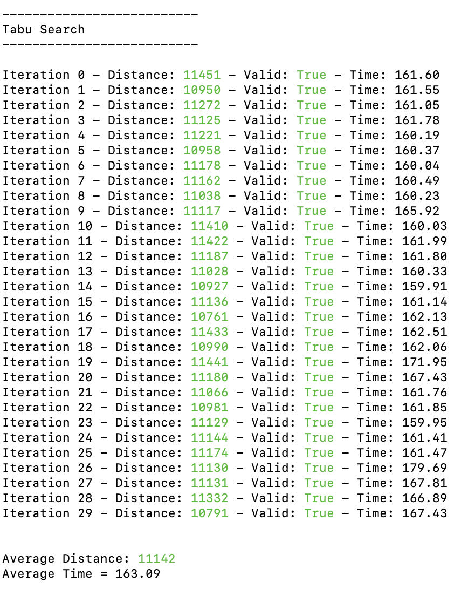
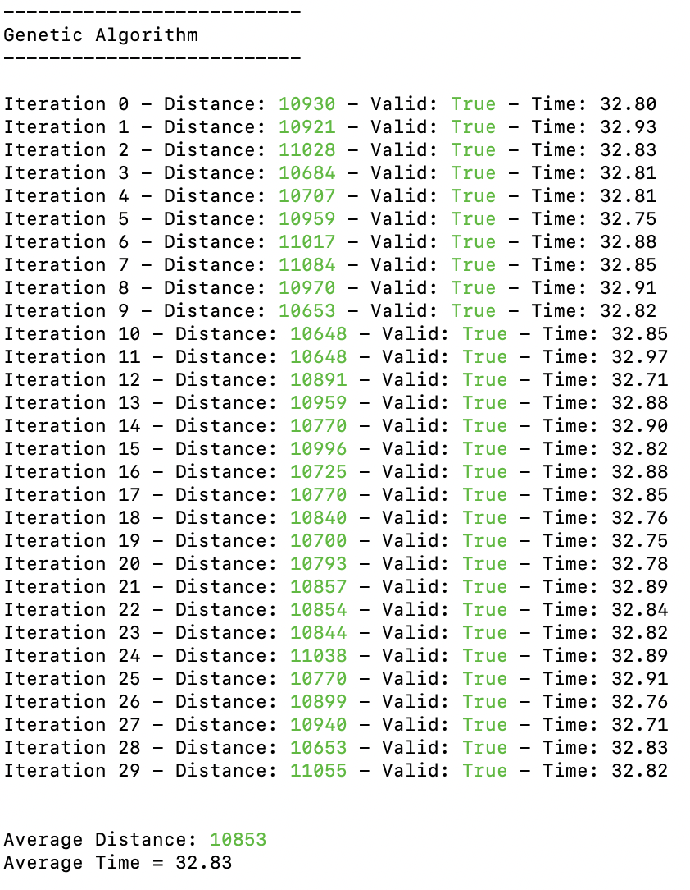

# Nature Inspired Search and Optimisation (Extended) Coursework

<div style="text-align:center; font-style: italic;">Edward Celella (2118317)</div>
<div style="text-align:center; font-style: italic;">emc918@student.bham.ac.uk</div>

---

[TOC]

<div style="page-break-after: always; break-after: page;"></div>

## Introduction

The travelling salesman problem (TSP) was first formalised by the Irish mathematician W.R.Hamilton in 1930. Although Hamilton was the first to formalise the problem, the need for a solution was required long before this, with one of the earliest accounts being the 1832 German handbook "Der Handlungsreisende – wie er sein soll und was er zu tun hat, um Aufträge zu erhalten und eines glücklichen Erfolgs in seinen Geschäften gewiß zu sein – von einem alten Commis-Voyageur" (The travelling salesman — how he must be and what he should do in order to get commissions and be sure of the happy success in his business — by an old *commis-voyageur*) (L. Applegate et al., 2011). Since then, TSP has become a staple of both mathematics and computer science due to its difficulty.

The TSP problem is defined as (Hoffman K.L. et al., 2013) :
$$
\begin{align*}
&\text{Given a list of } m \text{ cities. Where the cost of travelling from city } i \text{ to city } j \text{ is } c_{ij}. \\
&\text{What is the least costly route which visits all cities, and returns to the starting city?} \\
\end{align*}
$$
This paper discusses three different algorithms which can be used to solve TSP. Specifically these are: Simulated annealing, Tabu search, and a Genetic algorithm. Each of these algorithms will be described, as well as their implementations, which will be used to collect results. These results will then be compared using statistical methods in order to identify the optimal technique for TSP.

The data used in this study was provided by the TSPLIB library (Reinelt G., 1995). The specific dataset used contained $x, y$ co-ordinated for the 48 mainland United States capitols. This data was provided in a file called "ATT48.tsp". In addition to this, the optimal route was also given in the file "att48.opt.tour". For this problem, the "cost" of travelling between each city was defined as the pseudo-euclidian distance, which was calculated using the following formula (Reinelt G., 1995):

```pseudocode
xd = x[i] - x[j];
yd = y[i] - y[j];
rij = sqrt( (xd*xd + yd*yd) / 10.0 ); tij = nint( rij );
if (tij<rij) dij = tij + 1;
else dij = tij;
```

Where $i$ is the current city, and $j$ the next city being travelled to on the route. Using this function, in conjunction with the given optimal route, the optimal distance was calculated to be 10628.

## Simulated Annealing

### Algorithm Description

Simulated annealing is based off the metallurgy process of annealing, in which a metal is heated and the cooled in order to reduce any defects. The algorithm applies the idea behind this technique, by allowing non-improvement random steps to take place, at a decreasing probability as time progresses (e.g. the non-improvement steps are the defects which reduce over time). The benefit of allowing these non-improvement steps is that it allows the algorithm to escape local optima.

Specifically, simulated annealing operates by beginning with a random solution. Then, with each iteration, a random neighbour solution is selected. If this neighbour solution is better than the current solution, the algorithm moves to this solution. However, if the neighbour is worse, it is selected with a probability of $P(s, s_{new}, t)$, where:
$$
P(s,s_{new},t) = \exp(\frac{s-s_{new}}{t}) \label{sa1}
$$
In which $t$ is the current 'temperature' of the algorithm. The temperature is determined by a cooling schedule. There are a variety of different cooling schedules, all of which are better for certain problems. One common cooling schedule is exponential multiplicative cooling, which is defined as (L. Applegate et al., 2011):
$$
T_k = T_0 . \alpha^k \kern{1.5em} 0.8 \leq \alpha \leq0.9 \label{sa2}
$$
Where $\alpha$ is the cooling rate, $T_0$ is the initial temperature, and $k$ is the current number of iterations. 

Throughout all these iterations the best solution found is stored and updated. Once the termination criteria is met (e.g. a maximum number of iterations), the best solution is returned.

### Implementation

The generic simulated annealing algorithm was implemented for the purposes of this study. The following is the pseudocode for the algorithm:

```pseudocode
current_route, best_route = generate_random_route()
for k = 0 to k_max do

	t = temperature(i, t_0, a)
	new_route = generate_neighbour_solution(current_route)
	
	if new_route < current_route then 
		route = new_route, current_dist = new_dist
	else if P(new_route, new_dist, t) > R(0, 1) then 
		route = new_route, current_dist = new_dist
	
	if new_route < best_route then 
		best_route = new_route, best_dist = new_dist

return best_route
```
Here, the function `P` is defined as described in $\text{Eq.}\ref{sa1}$, and the function `temperature` is defined as in $\text{Eq.}\ref{sa2}$. The decision to use the exponential multiplicative cooling schedule was due to the fact the algorithm was limited to 3000 iterations. Because of the low number of iterations, convergence on valid solutions had to happen quickly. This cooling schedule provides this functionality, by exponentially reducing the likelihood of moving to a less fit solution. The function `R` is simply a uniform random number generator between the values of zero and one. 

In order to generate neighbour solutions, the 2-Opt algorithm was implemented, which simply reverses a random subsection of the route. The pseudocode for this is as follows:

```pseudocode
start = random_number(0, length(route))
end   = random_number(start, length(route))
rev = reverse(route[start:end])

neighbour_route = route[0:start] ++ rev ++ route[end:]
```

### Optimisation

The two hyper-parameters used within this algorithm are:

1. `t_0`   - The initial temperature.
2. `a` ($\alpha$) - The cooling rate.

In order to optimise these parameters, 15 different combinations of the initial temperature and cooling rate where trialed twice, using the same starting route. The initial temperature was tested between the range 0.8-1.0. The reason for this decision is that during the first few iterations of the algorithm, an increase in movement in the search space should be encouraged due to the random starting point. The testing range for the cooling rate was the recommended range for the cooling schedule as shown in $\text{Eq.}\ref{sa2}$ (L. Applegate et al., 2011). The results of these tests are shown below.

| Initial Temperature (`t_0`) | Cooling Rate (`a` - $\alpha$) | Average Best Distance (2 Trials) |
| :-------------------------: | :---------------------------: | :------------------------------: |
|             0.8             |             0.800             |              12201               |
|             0.8             |             0.825             |              11536               |
|             0.8             |             0.850             |              11931               |
|             0.8             |             0.875             |              11865               |
|             0.8             |             0.900             |              11723               |
|             0.9             |             0.800             |              11822               |
|             0.9             |             0.825             |              11679               |
|             0.9             |             0.850             |              12025               |
|             0.9             |             0.875             |              11554               |
|             0.9             |             0.900             |              11728               |
|             1.0             |             0.800             |              11514               |
|             1.0             |             0.825             |              11642               |
|             1.0             |             0.850             |              11814               |
|             1.0             |             0.875             |              11914               |
|             1.0             |             0.900             |              11706               |

As the results show, the algorithm performs best with the highest possible initial temperature (1.0), and the lowest possible cooling rate (0.8). This is due to the fact these values enable the algorithm to search more of the solution space.

<div style="page-break-after: always; break-after: page;"></div>

## Tabu Search

### Algorithm Description

The tabu search algorithm can be considered a greedy search algorithm. This is because it will select the best neighbour solution, unlike simulated annealing which selects a random neighbour (with a certain probability). Although the benefits of this neighbour selection technique are obvious, it does provide some problems. Specifically the this can cause the algorithm to become stuck around local optima very easily.

The solution to this problem is the use of a tabu list, which is a record of previous solutions that have been visited. By preventing the algorithm from revisiting these solutions, it can then escape the local optima that it would otherwise become trapped in. The implementation of the tabu list can vary, however this study will only consider a short-term memory in which only the previous $k$ steps are stored.

During the iterations of the algorithm, the best solution is stored and updated. Once the termination criteria is met, this solution is returned.

### Implementation

The short-term memory tabu search algorithm was implemented for this study. This model of the algorithm was chosen for two main reasons. The first being that due to the limited number of iterations for each trial (3000), convergence around an optima needed encouragement. Therefore by having a short term memory, the algorithm could revisit optima. The second reason was due to the computation cost of having a long term memory. The tabu search algorithm already requires a total search of the neighbourhood for each route it moves to, which is computationally expensive. So to mitigate some of the possible increases in time, a size cap was placed on the tabu list, thus minimising the amount of comparisons required for each neighbour. The pseudocode for the implemented tabu list is shown below:

```pseudocode
current_route, best_route = generate_random_route()
tabu_list = [current_route]
for k = 0 to k_max do

  neighbourhood = get_neighbourhood(current_route)

  best_cand = neighbourhood[0]
  for cand in neighbourhood do
  	if not in_tabu(tabu, cand) and (cand_dist < best_cand) then 
  		best_cand = cand

  if best_cand_dist < best_dist then 
  	best_route = best_cand

  tabu.append(best_cand)
  if length(tabu) > max_tabu_size then 
  	tabu = tabu.pop()

return best_route
```

In order to generate the neighbourhood of solutions, the 2-Opt algorithm was once again utilised. The following pseudocode shows how all possible neighbours are generated, given a route:

```pseudocode
neighbourhood = []
for i = 0 to length(route) do
		for j = i to length(route)do
			rev = reverse(route[start:end])

			new_route = route[:i] + rev + route[j:]
			neighbourhood.append(new_route)

return neighbourhood
```

### Optimisation

The only hyper-parameter in the given implementation of the tabu search algorithm is the maximum size of the tabu list. Due to this a range of tabu list sizes were tested, with each size being run three times to obtain an average. Again, the same starting route was used for each test. The results of the tests are shown below:

| Tabu List Maximum Size | Average Best Distance (3 Trials) |
| :--------------------: | :------------------------------: |
|           10           |              11070               |
|           20           |              11070               |
|           30           |              11070               |
|           40           |              11070               |
|           50           |              11070               |
|           60           |              11070               |
|           70           |              11070               |
|           80           |              11070               |
|           90           |              11070               |

Surprisingly, the data shows that the maximum size of the tabu list has no effect on the best distance obtained. This could be due to a variety of reasons, such as the specific dataset being used has very few local optima. Due to the results obtained, and the computation time problem previous described, a small maximum tabu list size of 15 will be utilised.

## Genetic Algorithm

### Algorithm Description

Genetic algorithms are based off the evolutionary selection process of survival of the fittest (Darwin, C. 1859). Unlike the previous two algorithms discussed in this paper, each iteration of a genetic algorithm operates over a population of generated solutions. This population undergoes four main steps each iteration:

1. _Selection_: Parents are selected from the population based on their fitness value.
2. _Variation_: Offspring are generated by applying an operator to "breed" the selected parents.
3. _Fitness Evaluation_: Each offsprings fitness is evaluated.
4. _Reproduction_: A new population is generated using the parents and offspring.

Each step can be implemented in a variety of ways, utilising multiple different techniques that have been produced. For example the selection process can simply be selecting the best $k$ individuals, or by utilising a more advanced system such as tournament selection, which randomly selects a few individuals from the population and then chooses the best from this sub group.

The general principle behind this algorithm is that by breeding individuals with high fitness, the properties that they contain which make them better will be passed on. This is used in conjunction with mutation operators (applied in the reproduction stage), which randomly change aspects of the offspring in order to encourage exploration. Once the termination criteria is met, the individual in the current population with the highest fitness is used as the solution.

### Implementation

For the purposes of this study a real-valued encoding system was used (e.g. the routes were used directly). This decision was made as using a system such as binary encoding would be unnecessarily complicated, when it is only the order of the nodes which require changing. The general template for genetic algorithms was used, the pseudocode of which is shown below:

```pseudocode
population = []
for i = 0 to population_size do
	population.append(generate_random_route())

for k = 0 to k_max then

  children = []
  while len(children) < pop_size do
    parent1, parent2 = selection(population)
    child1, child2 = variation(parent1, parent2)
    children.append(child1, child2)

	population = reproduction(population, children)

return best_individual(population)
```

Due to the limited number of generations allowed (3000), the binary tournament selection function was implemented. This selection process was used as it heavily encourages exploration, as the probability of selecting the two highest parents is unlikely. This does however decrease the exploitation factor of the algorithm, due to the fact two random parents are selected. The pseudocode for this selection method is as follows (this pseudocode allows for any number of individuals to be selected for the tournament):

```pseudocode
tour_size = 2
selected = []

while length(selected) < tour_size do
  p = random(population)
  if p not in selected then
  	selected.add(p)

	p1 = selected.pop(), p2 = selected.pop()
	for i in selected do
		if fitness(i) < fitness(p1) then
			if fitness(p1) < fitness(p2) then
				p2 = p1
			p1 = i
		else if fitness(i) < fitness(p2) then
			p2 = i

	return p1, p1
```

Once the parents have been selected, they undergo a variation operator to produce offspring. Specifically the variation operator used in this instance is the order crossover operator (OCO). The OCO was proposed by Lawrence Davis, and simply operates by choosing two crossover points. The nodes between these points are preserved from both parents, and each is used for the foundation of an offspring. Each offspring then receives the remaining route from the other parent (with duplicates removed). Therefore this process preserves route validity, whilst crossing over two parents (Davis, L., 1985).

```pseudocode
start = random(0, route_length)
end = random(start, route_length)

offspring1 = parent1[start:end]
offspring2 = parent2[start:end]

temp1 = remove_duplicates(parent2[end:] + parent2[:end], offspring1)
temp2 = remove_duplicates(parent1[end:] + parent1[:end], offspring2)

offspring1 = temp1[route_len-end:] + offspring1 + temp1[:route_len-end]
offspring2 = temp2[route_len-end:] + offspring2 + temp2[:route_len-end]

return offspring1, offspring2
```

The final key function implemented is that of reproduction. This function generates a new population from the offspring and parents. It does this in two steps. Firstly is keeps a certain percentage of the best parents. This elitism was implemented in order to counteract the loss of exploitation through the use of the binary tournament selection. Secondly the remaining gap in the population is filled with the fittest offspring, which each have a probability of undergoing a random mutation, decided by a hyper-parameter. The mutation itself is simple the 2-Opt algorithm described in simulated annealing, applied to the offspring. This further encourages exploration.

### Optimisation

The implementation of this algorithm required the optimisation of three hyper-parameters, which are:

1. Population Size - The size of each population per generation.
2. Mutation Probability - The probability an offspring will mutate.
3. Elitism Percentage - The amount of parents retained in reproduction.

Due to the large number of hyper-paramters, only one iteration of each unique set could be run. Due to this the general trend over the results was used to select the hyper parameters (The full set of results can be found in appendix A):

| Population Size | Mutation Probability | Elitism Percentage | Distance |
| --------------- | -------------------- | ------------------ | -------- |
| 30              | 0.3                  | 0.0                | 10684    |
| 30              | 0.7                  | 0.1                | 10694    |
| ....            | ...                  | ...                | ...      |
| 60              | 0.3                  | 0.0                | 10907    |
| 60              | 0.7                  | 0.1                | 10797    |
| ...             | ...                  | ...                | ...      |
| 90              | 0.3                  | 0.0                | 10838    |
| 90              | 0.7                  | 0.1                | 10752    |

Overall the trend showed that a higher population, coupled with moderate mutation probability and elitism, produced the best results. Therefore population size was set to 90, the mutation probability 0.5, and the elitism 0.1. This combination of values does make intuitive sense as the elitism retains exploitation, whilst the values of the mutation probability and population size increases the exploration.

## Results

Each algorithm was run 30 times using the obtained optimal hyper-parameters. The average distance obtained over the 30 trials was then calculated as well as the standard deviation. Shown below are the obtained averages and standard deviation for each algorithm (The full set of obtained results for each algorithm can be found in the appendix: simulated annealing in appendix B, tabu search in appendix C, and genetic algorithm in appendix D).

|      Algorithm      | Average Distance Obtained (30 Trials) | Standard Deviation | Average Time Taken (s) |
| :-----------------: | :-----------------------------------: | :----------------: | :--------------------: |
| Simulated Annealing |                 11681                 |       406.27       |          0.45          |
|     Tabu Search     |                 11142                 |       178.00       |         163.09         |
|  Genetic Algorithm  |                 10853                 |       134.47       |         32.83          |

Using the obtained results, the Wilcoxon signed rank statistical test was applied in order to compare the mean (average) values of the each algorithms results.

|                Comparison                 | Wilcoxon Signed Rank |      $p$ Value       |
| :---------------------------------------: | :------------------: | :------------------: |
|    Simulated Annealing vs. Tabu Search    |          16          | $0.8 \times 10^{-5}$ |
| Simulated Annealing vs. Genetic Algorithm |          0           | $0.2 \times 10^{-5}$ |
|     Tabu Search vs. Genetic Algorithm     |          18          | $1.0 \times 10^{-5}$ |

As shown each of the three algorithms obtained an average distance which fell within 10% of the optimal solution. Simulated annealing obtained the worst result out of the three, however each iteration took considerably less time compared to the others. This is due to the fact that each iteration in the algorithm only required the comparison of one randomly generated route. The tabu search performed the next best, however this improvement in results came at the cost of a significant time increase. This is due to the fact that each iteration required the generation of all neighbour solutions, which in turn have to each be compared to the tabu list in order to find the best recently non-visited neighbour. Finally, the best results were obtained by the genetic algorithm, with only a moderate increase in time compared to the simulated annealing results. This is because each iteration is limited by the population size, thus meaning that more neighbours could be compared whilst still limiting the time increase.

Another point of note is the differences in standard deviations. Unsurprisingly, simulated annealing had the highest standard deviation. This is again due to the fact each iteration selects one random neighbour, meaning that even with the same initial route, the results can vary drastically. The standard deviations for the genetic and tabu search are significantly reduced, again due to the fact each searches multiple (or in the case of tabu all) neighbour solutions. This therefore results in a reduction on the variation within the algorithm.

Due to the low $p$ values obtained through the Wilcoxon signed rank test, the hypothesis that the results obtained differ due to chance can be rejected. Thus meaning that the differences in results do not come from the same distribution.

## Conclusion

After evaluating the results obtained, it is clear that the genetic algorithm implemented is the best solution to the travelling salesman problem. This is due to the fact it obtained the shortest average distance overall, with a low variation between iterations, meaning it consistently produced good results. This comes a slight cost to computation time, however this increase isn't large when compared to the increase given by the tabu search.

Although the simulated annealing algorithm produced the worst results with the highest variation, due to the fast run-time, a case can be made that the results produced are good enough as a trade for the reduction is computation time. All results produced by the algorithm fell within 20% of the optimal solution, therefore if computational time is more important that overall accuracy this method should be utilised.

The stance of this paper is that tabu search is not a worthwhile solution to the travelling salesman problem. The drastic increase in computation time is not worth the slight increase in accuracy, especially when the genetic algorithm can obtain better results at a faster rate.

<div style="page-break-after: always; break-after: page;"></div>

## References

L. Applegate, D., E. Bixby, R., Chvátal, V. and J. Cook, W. (2011). *The Traveling Salesman Problem*. Princeton University Press, 2011.

Darwin, C. (1859). *On the origin of species by means of natural selection, or, the preservation of favoured races in the struggle for life*. London, J. Murray.

Davis, L., 1985, August. _Applying adaptive algorithms to epistatic domains_. In: *IJCAI* (Vol. 85, pp. 162-164).

Hoffman K.L., Padberg M., Rinaldi G. (2013). _Traveling Salesman Problem_. In: Gass S.I., Fu M.C. (eds) Encyclopedia of Operations Research and Management Science. Springer, Boston, MA

Reinelt, G., 1995. _TSPLIB 95 documentation_. University of Heidelberg.

<div style="page-break-after: always; break-after: page;"></div>

## Appendix

### Appendix A



### Appendix B



### Appendix C



### Appendix D

